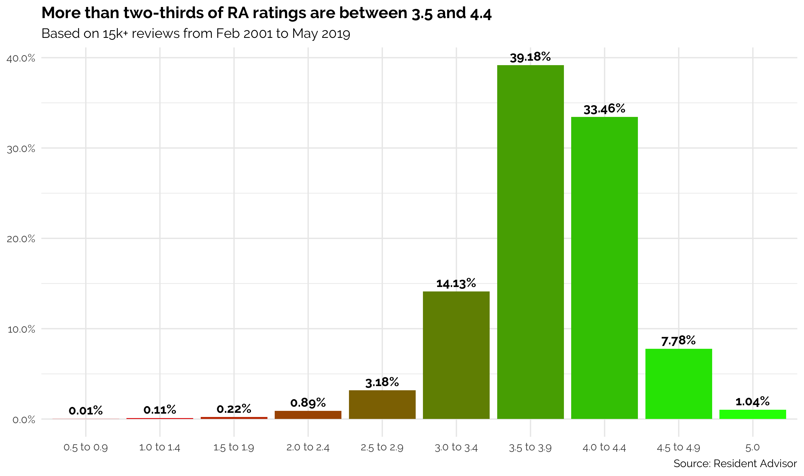
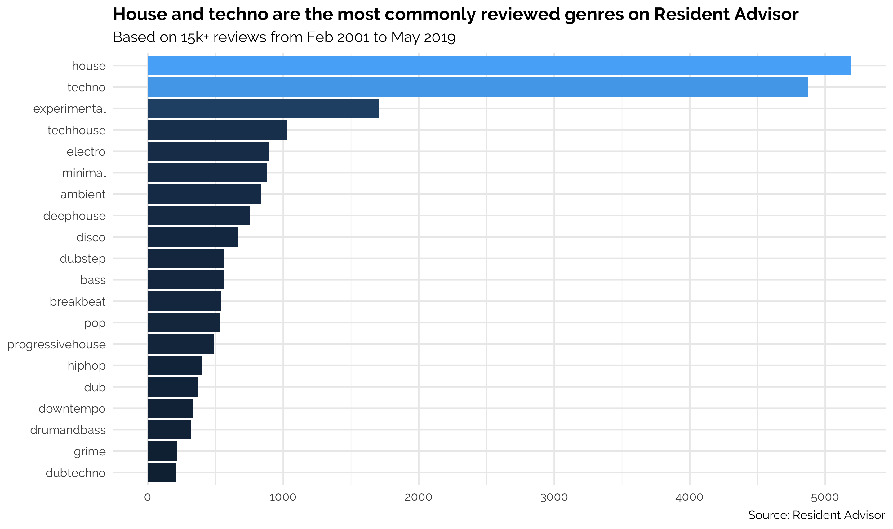

# Resident Advisor
Data and analysis for 15k+ reviews from the Resident Advisor website

Resident Advisor (also known as RA) is an online magazine dedicated to electronic music. Since its launch in October 2017, RA has reviewed thousands of LPs/EPs, which have ranged in style from house and techno to dubstep and drum and bass.

In May 2019, I scraped 15k+ reviews from the RA website using their parent URL, https://www.residentadvisor.net/reviews. I spent some time cleaning the data (see `data-prepation.R` for details) and have now released it publicly in CSV format. The dataset has seven fields:

* `title`: the name of the artist and the LP/EP
* `author`: the name of the journalist who wrote the review
* `date`: the date the review was published
* `genre`: the genre(s) associated with the album
* `rating`: a numerical score from 0.5 to 5.0
* `review`: the original text of the review
* `ra_recommends`: a binary indicator for whether the album received an 'RA Recommends' accolade

Note that, before 14 January 2015, albums were only rated in increments of 0.5 (0.5, 1.0, 1.5, etc). After that point, they could be awarded any score between 0.5 and 5.0 to one decimal place. A score less than 0.5 is possible in theory but has never been given.

## Example analysis

